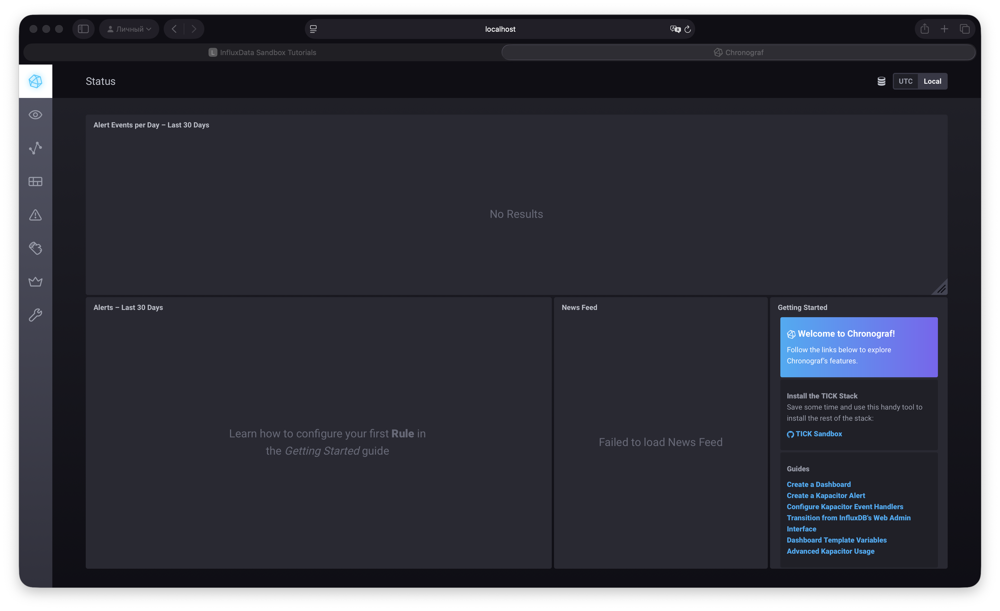
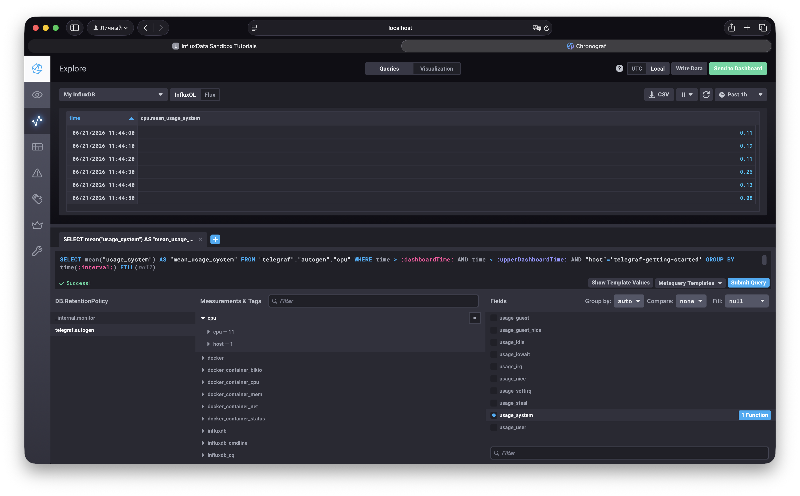
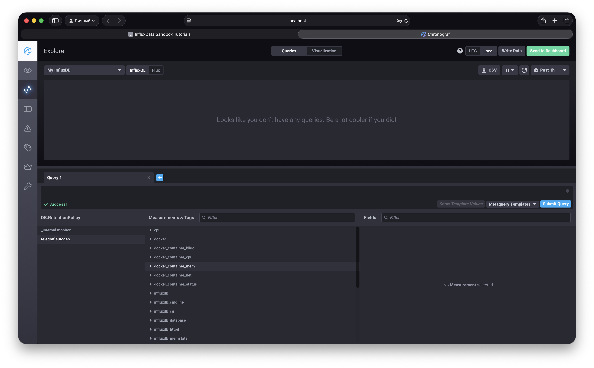
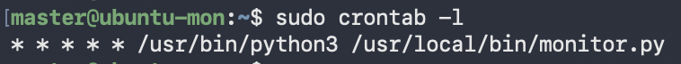

# Домашнее задание к занятию "Системы мониторинга" - Муравский Артем

1. Метрики можно распределить согласно четырем золотым SRE-сигналам:
- время отклика (latency) - время ответа HTTP
- величина трафика (traffic) - RPS (кол-во запросов в секунду)
- уровень ошибок (errors) - HTTP 5xx, ошибки IO, счётчик успешно записанных отчётов
- степень загруженности (saturation) - CPU, RAM, LA, IOPS, disk usage, inodes

2. Можно предложить использовать SLI, SLO, SLA
- SLO — целевой уровень качества обслуживания. Целевое значение или диапазон значений (например, в 99 % случаев мы должны отдавать HTTP-коды, отличные от 4xx/5xx. 1 % выделяется на техническое обслуживание.)
- SLA — соглашение об уровне обслуживания. Явный или неявный контракт с внешними пользователями, включающий в себя последствия невыполнения SLO (например, если наш сайт отдаёт HTTP-коды 4хх/5xx, то мы должны произвести денежную компенсацию пользователю, если это не запланированное техническое обслуживание)
- SLI — индикатор качества обслуживания. Конкретная величина предоставляемого обслуживания (например, SLI = (summ_2xx_requests + summ_3xx_requests) / (summ_all_requests))

3. Можно предложить использовать journald сервера, где развернуто приложение. Приложение можно запустить как сервис systemd или, если оно развернуто в Docker, то `docker logs` через драйвер journald для Docker.

4. Не учтены успешные коды http ответов 3xx, правильная формула будет выглядеть так: SLI = (summ_2xx_requests + summ_3xx_requests) / (summ_all_requests)

5. Системы мониторинга можно разделить на 2 подтипа: push-модель и pull-модель. Эти подтипы характеризуют процесс сбора метрик внутри системы мониторинга.

    Push-модель подразумевает отправку данных с агентов (рабочих машин, с которых собираем мониторинг) в систему мониторинга, через вспомогательные службы или программы (обычно UDP)
      Плюсы:
      - упрощение репликации данных в разные системы мониторинга или их резервные копии
      - более гибкая настройка отправки пакетов данных с метриками
      - UDP — это менее затратный способ передачи данных, из-за чего может возрасти производительность сбора метрик
      - агент может буферизовать данные при недоступности сервера
      - простота масштабирования
      - возможность работы через NAT и файрвол
      Минусы:
      - необходимость настройки и поддержки вспомогательных служб на агентах
      - нет контроля подлинности источника
      - выше нагрузка на агента (он постоянно тратит ресурсы на отправку)
  
    Pull-модель подразумевает последовательный или параллельный сбор системой мониторинга с агентов накопленной информации из вспомогательных служб
      Плюсы:
      - легче контролировать подлинность данных
      - можно настроить единый proxy server до всех агентов с TLS
      - упрощённая отладка получения данных с агентов
      Минусы:
      - необходимость настройки на стороне системы мониторинга (надо править конфиг мониторинга при каждом добавлении нового объекта мониторинга)
      - возможны проблемы работы через NAT и файрвол
      - выше нагрузка на сервер мониторинга
      - сложнее масштабирование

6. К системам, работающим по pull-модели относятся:
  - Prometheus
  - Nagios
К системам, работающим по push-модели относятся:
  - TICK
К системам, работающим по гибридной модели относятся:
  - Zabbix
  - VictoriaMetrics

  7. Скриншот стартовой страницы chronograf

  

8. Скриншот метрик утилизации cpu из веб-интерфейса

  

9. Скриншот наличия метрик docker

  

### Дополнительное задание (со звездочкой)

1. [Файл python-скрипта](src/monitor.py)

  [Файл лога](src/26-06-21-awesome-monitoring.log)

  Вывод расписания cron (команда `sudo crontab -l`)
  
  

2. Скриншот дашборда
  
  
