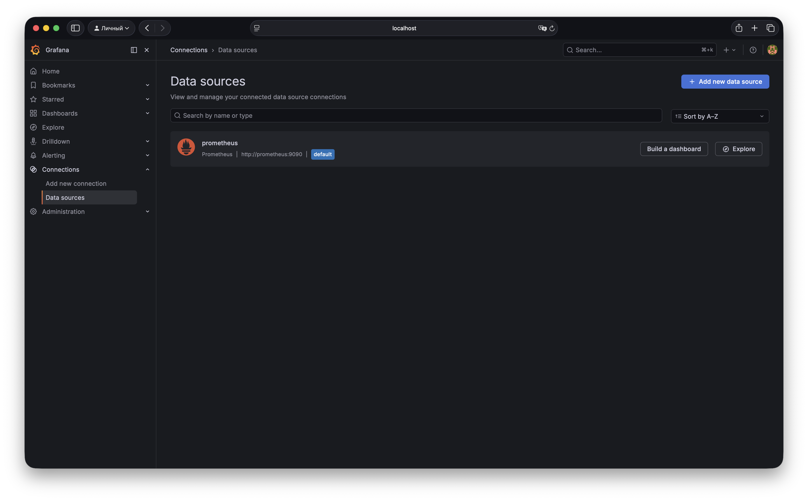
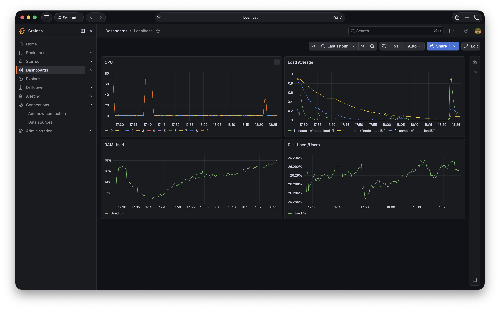
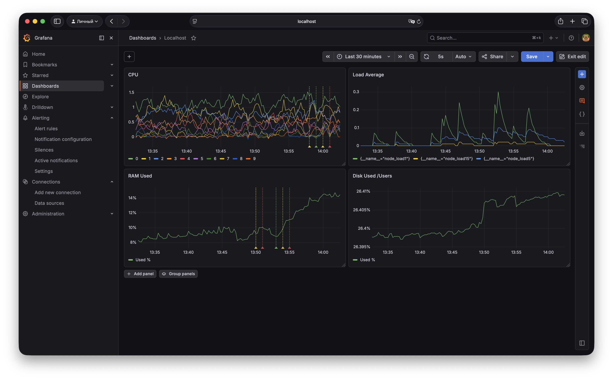

# Домашнее задание к занятию «Средство визуализации Grafana» - Муравский Артем

1. Скриншот подключенных к grafana источников данных
  

2. Скриншот дашборда в grafana
  

  Promql-запросы:
  - `100 - (rate(node_cpu_seconds_total{job="nodeexporter",mode="idle"}[1m]) * 100)` утилизация CPU для nodeexporter
  - `{__name__=~"node_load.+", job="nodeexporter"}` CPULA 1/5/15
  - `(1 - node_memory_MemAvailable_bytes{job="nodeexporter"} / node_memory_MemTotal_bytes{job="nodeexporter"}) * 100` количество свободной оперативной памяти
  - `100 - (node_filesystem_free_bytes{job="nodeexporter", mountpoint="/Users"} / node_filesystem_size_bytes{job="nodeexporter", mountpoint="/Users"} * 100)` количество места на файловой системе

3. Скриншот итогового дашборда в grafana
  

  Скриншот тестовых событий из каналов нотификаций (telegram)
  

4. [Файл с JSON дашборда](src/my_dashboard.json)
