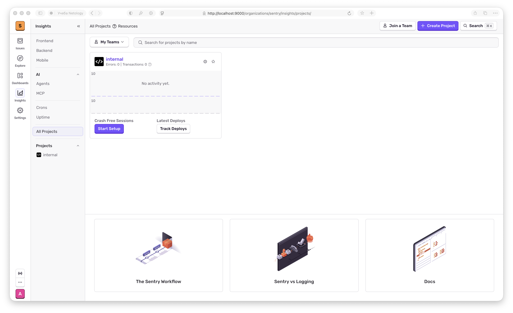
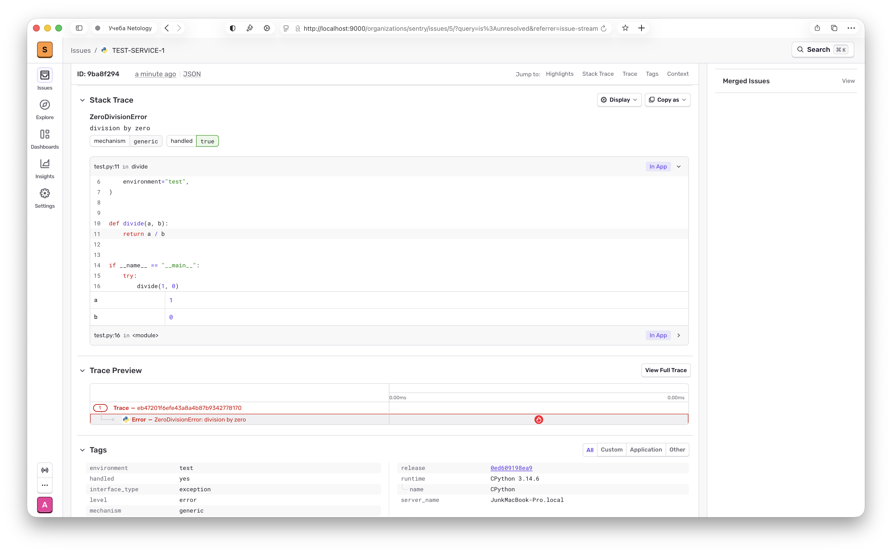
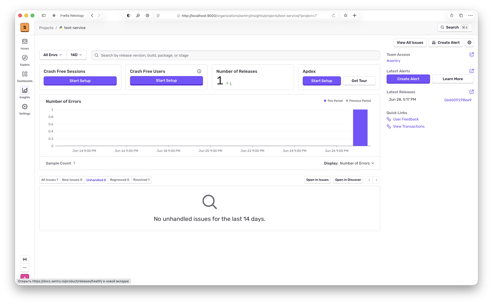
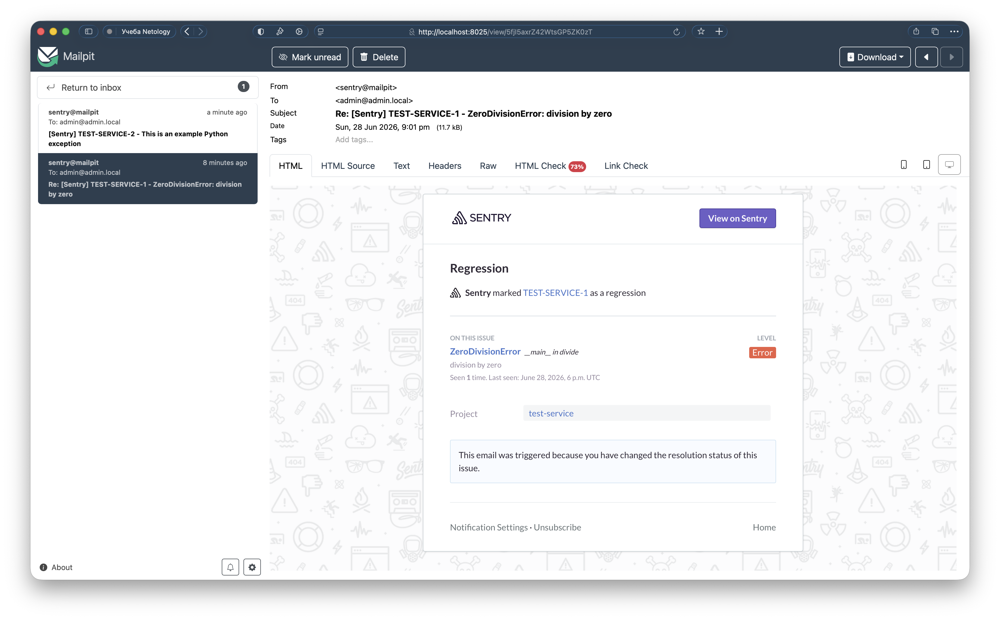

# Домашнее задание к занятию «Платформа мониторинга Sentry» — Муравский Артем

## Окружение

Sentry.io оказался недоступен (403), поэтому использована self-hosted версия. Sentry поднят локально через `getsentry/self-hosted` на Docker (OrbStack).

Доступен по адресу http://localhost:9000, учётка admin@admin.local.

Код Python-проекта — [src/test.py](src/test.py)

## Задание 1 — Projects

Скриншот меню Projects:

## Задание 2 — Событие и Stack Trace

Python-проект подключён через sentry-sdk ([src/test.py](src/test.py)). Сгенерировано исключение ZeroDivisionError.

Скриншот Stack trace:

Скриншот списка событий после Resolved (событие ушло из списка):

## Задание 3 — Алёртинг

Создано правило алёртинга «All Errors Alert» — срабатывает на любое событие и отправляет уведомление команде. Так как Sentry self-hosted, локальный SMTP заменён на Mailpit (http://localhost:8025).

После генерации события письмо пришло в Mailpit:

